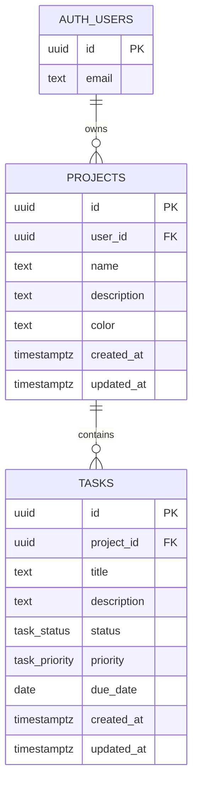

# ProjectPulse

**Manage projects. Track progress. Visualize productivity.**

ProjectPulse is a polished project-management dashboard built for focused individual workspaces. Authenticated users can manage projects and tasks, see completion derived from real task data, and view live analytics that synchronize across browser tabs.

## Features

- Email and password authentication with Supabase Auth
- Protected App Router workspace with persistent SSR sessions
- Full project CRUD with task counts, colors, completion, and created date
- Full task CRUD with status, priority, description, and due date
- Debounced project and task search
- Task status and priority badges
- Responsive dashboard shell, profile menu, mobile navigation, and accessible dialogs
- Loading, empty, error, and destructive-confirmation states
- Sonner feedback for successful and failed mutations
- Realtime refreshes for `projects` and `tasks` across tabs for the same account
- Task status distribution pie chart and 14-day task-creation line chart
- Row Level Security policies that isolate all workspace data by authenticated user

## Tech Stack

| Area | Technology |
| --- | --- |
| Framework | Next.js 16 App Router, React 19, TypeScript |
| Styling | Tailwind CSS 4, shadcn/ui (Base UI primitives) |
| Backend | Supabase Postgres, Supabase Auth, Supabase Realtime |
| Forms | React Hook Form, Zod, `@hookform/resolvers` |
| Charts | Recharts |
| UI | Lucide React, Sonner, date-fns |

## Folder Structure

```text
app/
  (auth)/                 Login and registration routes
  (dashboard)/            Protected workspace routes
    analytics/            Realtime analytics page
    dashboard/            Workspace overview
    projects/             Project list and details
components/
  analytics/              Recharts-based visualizations
  auth/                   Authentication form
  dashboard/              Workspace overview components
  layout/                 Responsive application shell
  projects/               Project forms, cards, and details
  shared/                 Realtime, empty states, badges, confirmation dialog
  tasks/                  Task forms and table
  ui/                     shadcn/ui primitives
hooks/                    Reusable client hooks
lib/
  data/                   Server-only Supabase data access
  supabase/               Browser, server, proxy clients and database types
  validations/            Shared Zod schemas
  analytics.ts            Derived chart-series helpers
supabase/
  migrations/             Schema, indexes, RLS, and Realtime setup
  seed.sql                Repeatable demo data
proxy.ts                  Next.js 16 session-refresh proxy
```

## Run Locally

### Prerequisites

- Node.js 20.9 or later
- A Supabase project

### Setup

1. Install dependencies:

   ```bash
   npm install
   ```

2. Create the local environment file:

   ```bash
   cp .env.example .env.local
   ```

3. Add your Supabase project URL and **publishable** key to `.env.local`.

4. Apply `supabase/migrations/20260711000000_create_projectpulse_schema.sql` in the Supabase SQL Editor, or with the Supabase CLI.

5. Start the development server:

   ```bash
   npm run dev
   ```

6. Open [http://localhost:3000](http://localhost:3000). Register an account and create a project.

### Scripts

```bash
npm run dev     # Start Next.js in development mode
npm run lint    # Run ESLint
npm run build   # Create a production build
npm run start   # Serve the production build
```

## Environment Variables

| Variable | Purpose | Safe for browser? |
| --- | --- | --- |
| `NEXT_PUBLIC_SUPABASE_URL` | Supabase project URL | Yes |
| `NEXT_PUBLIC_SUPABASE_PUBLISHABLE_KEY` | Supabase publishable client key | Yes, protected by RLS |

Never add a Supabase `service_role` key to this application or to Vercel. ProjectPulse makes data requests with the user session and relies on RLS as the authorization boundary.

## Supabase Setup

1. Create a Supabase project.
2. In **Authentication > Providers**, keep Email enabled.
3. In **Authentication > URL Configuration**, add local and production application URLs. For example: `http://localhost:3000` and your Vercel URL. The app requests `/dashboard` as the email confirmation redirect target.
4. Copy the Project URL and publishable key from **Project Settings > API** into `.env.local`.
5. Run the migration in `supabase/migrations/`.
6. Confirm that `projects` and `tasks` appear in the `supabase_realtime` publication after the migration runs.

## SQL Schema

The source of truth is [`supabase/migrations/20260711000000_create_projectpulse_schema.sql`](./supabase/migrations/20260711000000_create_projectpulse_schema.sql).

| Table | Key fields |
| --- | --- |
| `projects` | `id`, `user_id`, `name`, `description`, `color`, timestamps |
| `tasks` | `id`, `project_id`, `title`, `description`, `status`, `priority`, `due_date`, timestamps |

`task_status` is constrained to `todo`, `in_progress`, and `completed`. `task_priority` is constrained to `low`, `medium`, and `high`. Timestamp triggers set `updated_at` on every update. Indexes support the user/project ownership and task-list access patterns.

## ER Diagram



## RLS Explanation

RLS is enabled for both tables. Every project policy compares `projects.user_id` to `auth.uid()` for `SELECT`, `INSERT`, `UPDATE`, and `DELETE`.

Tasks do not duplicate `user_id`. Their policies authorize access through an `EXISTS` check against the parent project, where the parent project must belong to `auth.uid()`. This normalized design prevents a user from reading, adding, updating, or deleting tasks in another account’s project, including when a request is made directly to Supabase outside the UI.

## Realtime Explanation

The migration adds both tables to `supabase_realtime` and enables full replica identity, so inserts, updates, and deletes can be broadcast with useful row payloads. `RealtimeRefresh` subscribes to both table streams in the protected workspace layout and calls `router.refresh()` on a change. Because refreshed server queries still run with the signed-in user’s session and RLS, two tabs using the same account update promptly without exposing another user’s data.

## Charts

- **Task status distribution:** a pie chart of Todo, In progress, and Completed tasks.
- **Tasks created over time:** a line chart of new tasks over the last 14 days.

Both are generated from live `tasks` data and automatically update after a Realtime event.

## Seed Data and Demo Account

The seed script intentionally does not create an `auth.users` row or embed a password hash.

1. Register `demo@projectpulse.app` through the app (choose your own password), or create it in Supabase Auth.
2. If email confirmation is enabled, confirm the account.
3. Run [`supabase/seed.sql`](./supabase/seed.sql) in the Supabase SQL Editor.
4. Sign in with the demo account. The script creates three sample projects and six sample tasks.

The script is idempotent for its fixed sample IDs, so it can be run again without duplicate records.

## Deployment to Vercel

1. Push the repository to a Git provider and import it in Vercel.
2. Set `NEXT_PUBLIC_SUPABASE_URL` and `NEXT_PUBLIC_SUPABASE_PUBLISHABLE_KEY` in Vercel’s project environment variables.
3. Add the Vercel production URL to Supabase Auth redirect URLs.
4. Deploy. Vercel detects Next.js automatically; no custom build setting is required.

## Known Limitations

- The product is intentionally scoped to personal workspaces: there are no project members, roles, or cross-user collaboration permissions.
- Realtime uses server-data refreshes for consistency rather than local optimistic reconciliation. Mutations still show immediate pending and success/error feedback.
- Email confirmation behavior depends on the Supabase Auth setting for the project.
- There is no automated test suite yet; lint and production builds provide baseline verification.

## Future Improvements

- Add project membership, invitations, and role-based project policies.
- Add task assignees, comments, activity history, and attachments.
- Add filtering by status, priority, and due date.
- Add optimistic local cache updates for high-latency environments.
- Add unit, integration, and browser-level test coverage.
