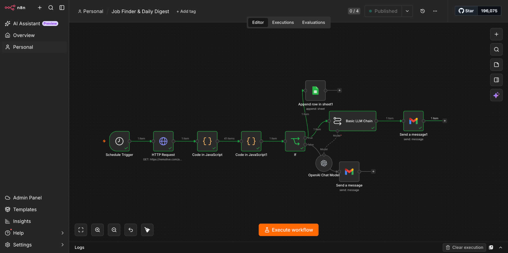
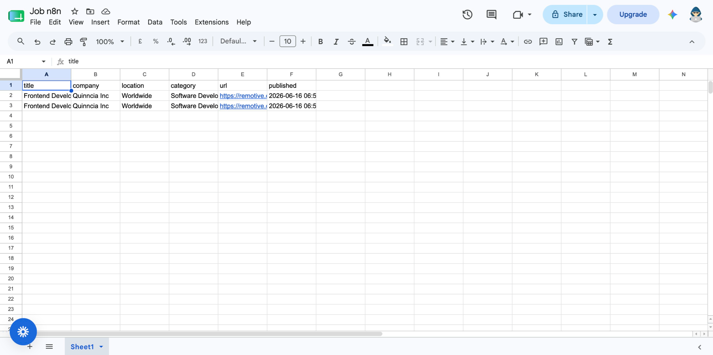
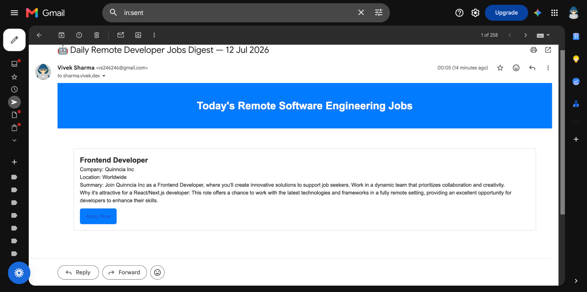

# Job Finder & Remote Jobs Digest

An n8n workflow that finds remote developer jobs, saves matching roles to Google Sheets, and sends an AI-generated HTML email digest.



## What It Does

1. Runs at minute 1 of every hour.
2. Fetches remote jobs from the [Remotive API](https://remotive.com/api/remote-jobs).
3. Keeps jobs whose titles include one of these keywords: `react`, `next`, `next.js`, `typescript`, `node`, `node.js`, `frontend`, `full stack`, or `javascript`.
4. If matches are found:
   - Appends each job to a Google Sheet.
   - Uses an LLM to create a responsive HTML email with job summaries, React/Next.js relevance, and top-three recommendations.
   - Sends the digest through Gmail.
5. If no jobs match, sends a short Gmail notification instead.

## Requirements

- An n8n instance with the built-in LangChain nodes available.
- Gmail OAuth2 credentials with permission to send email.
- Google Sheets OAuth2 credentials with permission to edit the target spreadsheet.
- An LLM provider credential. The included workflow uses OpenAI with `gpt-4o-mini`.

## Setup

1. In n8n, select **Workflows** and import [`workflow.json`](workflow.json).
2. Create or select your Gmail OAuth2 credential, then assign it to both Gmail nodes:
   - `Send a message` (no matching jobs)
   - `Send a message1` (daily digest)
3. Create or select your Google Sheets OAuth2 credential and assign it to `Append row in sheet1`.
4. Choose a spreadsheet and sheet in `Append row in sheet1`. Ensure the sheet has these header columns:

   ```text
   title, company, location, category, url, published
   ```

5. Create or select an OpenAI credential and assign it to `OpenAI Chat Model`. Use an account with access to the selected model, or choose another supported chat model.
6. Update the recipient address in both Gmail nodes.
7. Optionally edit the keyword list in `Code in JavaScript1` and the schedule in `Schedule Trigger`.
8. Execute the workflow manually to verify the credentials, sheet mapping, and email output. Activate it after the test succeeds.

## Screenshots

### Google Sheet Output



### Email Digest



## Notes

- The imported workflow references credentials from its original n8n instance. Replace every credential association after import; credential IDs are not portable.
- Job filtering currently checks only the job title. Adjust the JavaScript filter node if you want to include description, location, category, or additional keywords.
- The workflow runs hourly by default, despite the email subject referring to a daily digest. Change the schedule if a daily digest is intended.
